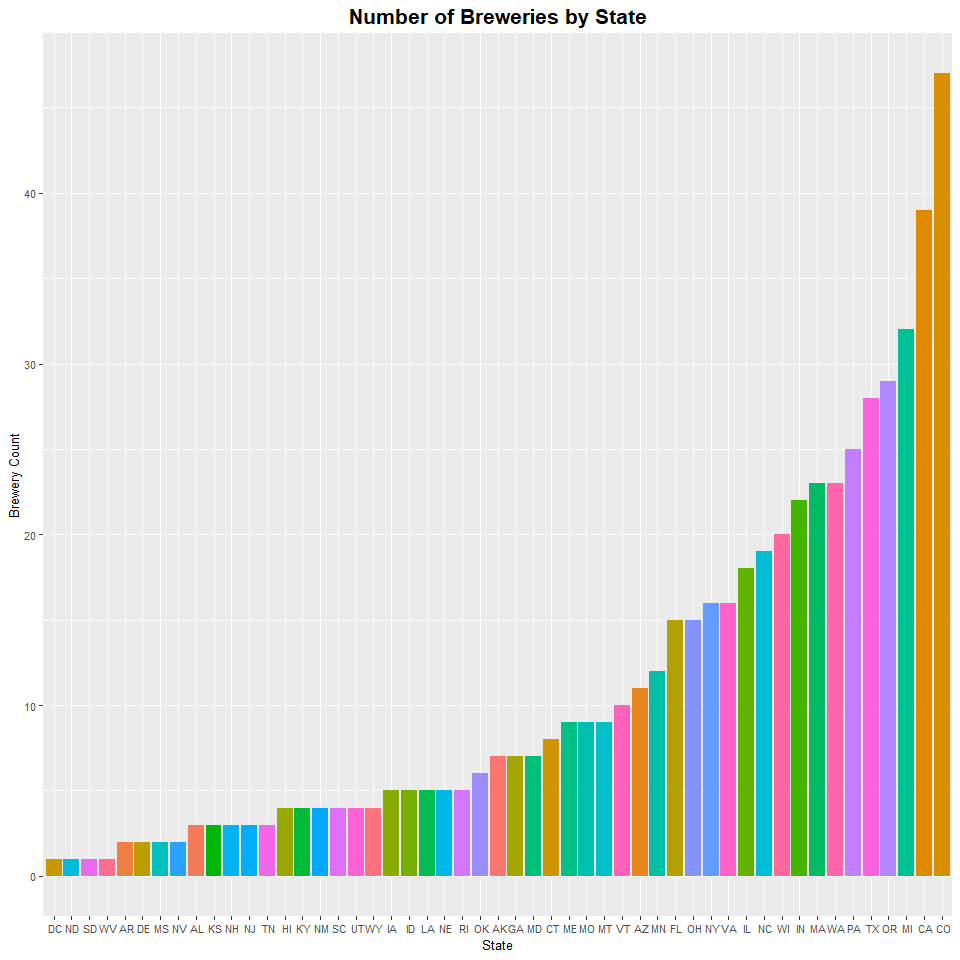
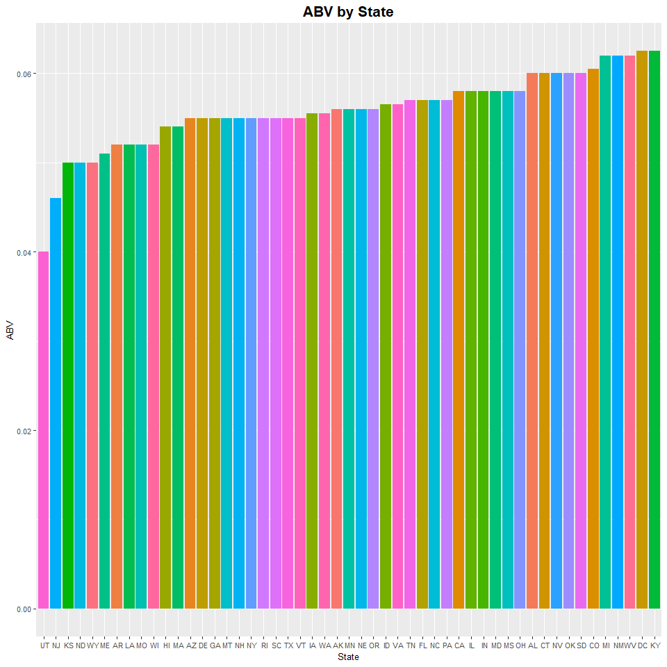
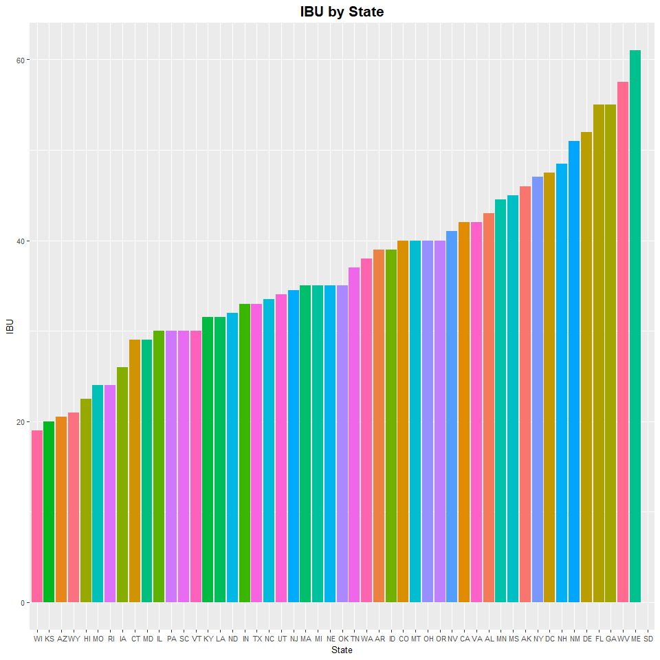
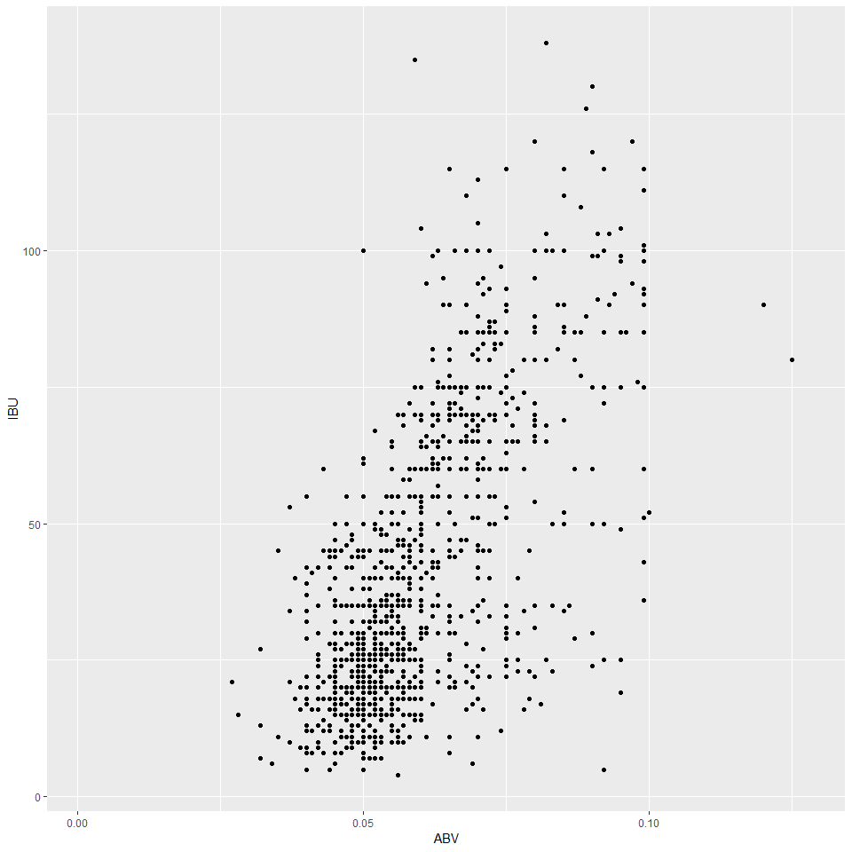

#Introduction
The intent of the following outputs is to provide information related to analysis of beers and brewing within the United States. The team has investigated various items based on data sets that have been provided. The team has broken the analysis out into specific questions that needed to be answered. 

##Additional Notes
- All necessary files to recreate this analysis are located in the following GitHub repository: https://github.com/jbcroom/DS6306-MinerLeague-CaseStudies
- The markdown contains the ability for the user to set their working path to ensure data can be executed in a reproducible fashion. 
- The markdown requires the user have the dplyr and ggplot2 libraries installed.

###Initial Code Setup - The code chunk below is for setup of the environment and loading in the required data files


```r
#commented out code below provides the necessary code to install required packages is needed
#install.packages("dplyr")
#install.packages("ggplot2")

#load necessary libraries
library(dplyr)
library(ggplot2)

#Setup the environment for working. Change the WorkingDirPath variable as needed to set the appropriate working directory
#WorkingDirPath = "C:/Users/sojha.WVOFFICE.000/Documents/SMU/Summer 2019/Doing Data Science/CaseStudy1_2_2_2"
WorkingDirPath = "C:\\Users\\croomb\\OneDrive - BAT\\Desktop\\Personal Training\\SMU\\DS 6306 - Doing Data Science\\DS6306-MinerLeague-CaseStudies\\CaseStudy1"
setwd(WorkingDirPath)

#Set variables for the file locations. Assumption here that the existing GitHub structure will be used.
beerFile = ".\\Data\\Beers.csv"
breweryFile = ".\\Data\\Breweries.csv"

#Read the files into dataframes
beerDF = read.csv(beerFile)
breweryDF = read.csv(breweryFile)
```

***

####Question 1 : How many breweries are present in each state?

```r
#Counting the number of breweries by state. Requrn them in descending count order
brewerysByState = breweryDF %>% count(State,sort=TRUE)

#Add human redable names to the brewerysByState dataframe
names(brewerysByState) = c("State", "Count")

#Print out the listing of breweries and counts. NOTE: since DC is in the list there are 51 total entries
print(brewerysByState,n=51)
```

```
## # A tibble: 51 x 2
##    State Count
##    <fct> <int>
##  1 " CO"    47
##  2 " CA"    39
##  3 " MI"    32
##  4 " OR"    29
##  5 " TX"    28
##  6 " PA"    25
##  7 " MA"    23
##  8 " WA"    23
##  9 " IN"    22
## 10 " WI"    20
## 11 " NC"    19
## 12 " IL"    18
## 13 " NY"    16
## 14 " VA"    16
## 15 " FL"    15
## 16 " OH"    15
## 17 " MN"    12
## 18 " AZ"    11
## 19 " VT"    10
## 20 " ME"     9
## 21 " MO"     9
## 22 " MT"     9
## 23 " CT"     8
## 24 " AK"     7
## 25 " GA"     7
## 26 " MD"     7
## 27 " OK"     6
## 28 " IA"     5
## 29 " ID"     5
## 30 " LA"     5
## 31 " NE"     5
## 32 " RI"     5
## 33 " HI"     4
## 34 " KY"     4
## 35 " NM"     4
## 36 " SC"     4
## 37 " UT"     4
## 38 " WY"     4
## 39 " AL"     3
## 40 " KS"     3
## 41 " NH"     3
## 42 " NJ"     3
## 43 " TN"     3
## 44 " AR"     2
## 45 " DE"     2
## 46 " MS"     2
## 47 " NV"     2
## 48 " DC"     1
## 49 " ND"     1
## 50 " SD"     1
## 51 " WV"     1
```

```r
#Ploting the number of breweries in each state to provide a visual output
ggplot(data=brewerysByState, aes(x=reorder(State,Count), y=Count, fill=State)) + geom_bar(stat="identity", show.legend = FALSE) + labs(x ="State",y="Brewery Count",title="Number of Breweries by State") + theme(plot.title = element_text(size = 16,face= "bold",hjust = 0.5)) + theme(axis.text = element_text(size=8),axis.title=element_text(size=10))
```

<!-- -->

#### As shown in the table above there are breweries located in all 50 states and Washington DC. Colorado (CO) has the most breweries with 47, while North Dakota (ND), South Dakota (SD), Washington, DC (DC) and West Virginia (WV) have the least number of breweries with 1. The graph provides an additional visualization of the data. 

***

####Question 2 : Merge beer data with the breweries data.  Print the first 6 observations and the last six observations to check the merged file.

```r
#Merging the beer and breweries data into a new data frame
BeersAndBreweriesDF = merge(x=beerDF,y=breweryDF,by.x="Brewery_id",by.y="Brew_ID")

#Cleanup the names of the columns to make the data more understandable
names(BeersAndBreweriesDF) = c("Brewery_id","Beer_Name","Beer_ID","ABV","IBU","Beer_Style","Beer_OZ","Brewery_Name","Brewery_City","Brewery_State")

#Display the first 6 and last 6 entries to confirm merge was successful
head(BeersAndBreweriesDF,6)
```

```
##   Brewery_id     Beer_Name Beer_ID   ABV IBU
## 1          1  Get Together    2692 0.045  50
## 2          1 Maggie's Leap    2691 0.049  26
## 3          1    Wall's End    2690 0.048  19
## 4          1       Pumpion    2689 0.060  38
## 5          1    Stronghold    2688 0.060  25
## 6          1   Parapet ESB    2687 0.056  47
##                            Beer_Style Beer_OZ       Brewery_Name
## 1                        American IPA      16 NorthGate Brewing 
## 2                  Milk / Sweet Stout      16 NorthGate Brewing 
## 3                   English Brown Ale      16 NorthGate Brewing 
## 4                         Pumpkin Ale      16 NorthGate Brewing 
## 5                     American Porter      16 NorthGate Brewing 
## 6 Extra Special / Strong Bitter (ESB)      16 NorthGate Brewing 
##   Brewery_City Brewery_State
## 1  Minneapolis            MN
## 2  Minneapolis            MN
## 3  Minneapolis            MN
## 4  Minneapolis            MN
## 5  Minneapolis            MN
## 6  Minneapolis            MN
```

```r
tail(BeersAndBreweriesDF,6)
```

```
##      Brewery_id                 Beer_Name Beer_ID   ABV IBU
## 2405        556             Pilsner Ukiah      98 0.055  NA
## 2406        557  Heinnieweisse Weissebier      52 0.049  NA
## 2407        557           Snapperhead IPA      51 0.068  NA
## 2408        557         Moo Thunder Stout      50 0.049  NA
## 2409        557         Porkslap Pale Ale      49 0.043  NA
## 2410        558 Urban Wilderness Pale Ale      30 0.049  NA
##                   Beer_Style Beer_OZ                  Brewery_Name
## 2405         German Pilsener      12         Ukiah Brewing Company
## 2406              Hefeweizen      12       Butternuts Beer and Ale
## 2407            American IPA      12       Butternuts Beer and Ale
## 2408      Milk / Sweet Stout      12       Butternuts Beer and Ale
## 2409 American Pale Ale (APA)      12       Butternuts Beer and Ale
## 2410        English Pale Ale      12 Sleeping Lady Brewing Company
##       Brewery_City Brewery_State
## 2405         Ukiah            CA
## 2406 Garrattsville            NY
## 2407 Garrattsville            NY
## 2408 Garrattsville            NY
## 2409 Garrattsville            NY
## 2410     Anchorage            AK
```
#### As shown in the tables above we can confirm that the data has been merged successfully via looking at the first and last 6 records of the data set.

***

####Question 3 : Report the number of NA's in each column.

```r
#Sum the NAs in the datafram and display the total counts for all columnt
sapply(BeersAndBreweriesDF, function(x) sum(is.na(x)))
```

```
##    Brewery_id     Beer_Name       Beer_ID           ABV           IBU 
##             0             0             0            62          1005 
##    Beer_Style       Beer_OZ  Brewery_Name  Brewery_City Brewery_State 
##             0             0             0             0             0
```
#### The table above shows the number of NAs (or missing values) in the data. In this instance there are 62 missing values in the ABV column and 1005 missing values in the IBU column. 

***


####Question 4 : Compute the median alcohol content and international bitterness unit for each state.  Plot a bar chart to compare.

```r
#Calculating the median ABV and median IBV by state. Ignoring missing values
ABVByState = BeersAndBreweriesDF %>% group_by(Brewery_State) %>% summarise(median=median(ABV,na.rm=TRUE))
IBUByState = BeersAndBreweriesDF %>% group_by(Brewery_State) %>% summarise(median=median(IBU,na.rm=TRUE))

#Cleanup the dataframe names
names(ABVByState) = c("State","MedianABV")
names(IBUByState) = c("State","MedianIBU")

#Remove any extraneous NAs from the data
ABVByState = na.omit(ABVByState)
IBUByState = na.omit(IBUByState)

#Bar charts for comparison
#ABVByState
 ggplot(data=ABVByState, aes(x=reorder(State,MedianABV), y=MedianABV, fill=State)) + geom_bar(stat="identity", show.legend = FALSE) + labs(x ="State",y="ABV",title="ABV by State") + theme(plot.title = element_text(size = 16,face= "bold",hjust = 0.5)) + theme(axis.text = element_text(size=8),axis.title=element_text(size=10))
```

<!-- -->

```r
#IBUByState
  ggplot(data=IBUByState, aes(x=reorder(State,MedianIBU), y=MedianIBU, fill=State)) + geom_bar(stat="identity", show.legend = FALSE) + labs(x ="State",y="IBU",title="IBU by State") + theme(plot.title = element_text(size = 16,face= "bold",hjust = 0.5)) + theme(axis.text = element_text(size=8),axis.title=element_text(size=10))
```

<!-- -->

#### The two graphs, ABV by State and IBU by State, depict the median alcohol content (ABV) and international bitterness unit (IBU) values for each state. It can be seen from the ABV by State graph that Kentucky (KY) has the highest median ABV while Utah (UT) has the lowest ABV. In reviewing the IBU graph, it can be seen that Maine (ME) has the highest median IBU value while Wisconsin (WI) has the lowest median IBU value.  

***

####Question 5 : Which state has the maximum alcoholic(ABV) beer? Which state has the most bitter (IBU) beer ?


```r
 #Filter the data to get the single row with maximum ABV
 maxABVStateDF = BeersAndBreweriesDF %>% filter(ABV == max(ABV,na.rm=TRUE))
 
 #Put just the Brewery State in a vector
 maxABVState = maxABVStateDF$Brewery_State[1]
 as.character(maxABVState)
```

```
## [1] " CO"
```

```r
 #Filter the data to get the single row with maximum IBU
 maxIBUStateDF = BeersAndBreweriesDF %>% filter(IBU ==   max(IBU,na.rm=TRUE))
 
 #Put just the Brewery State in a vector
 maxIBUState = maxIBUStateDF$Brewery_State[1]
 as.character(maxIBUState)
```

```
## [1] " OR"
```
#### Based on the information provided above Colorado (CO) has the highest ABV of all states in the data set. Oregon (OR) has the most bitter beer (highest IBU) of all states in the data set.  

***


####Question 6 : Summary Statistics for the ABV variable.

```r
 #summary statistics for the ABV variable
 summary(BeersAndBreweriesDF$ABV)
```

```
##    Min. 1st Qu.  Median    Mean 3rd Qu.    Max.    NA's 
## 0.00100 0.05000 0.05600 0.05977 0.06700 0.12800      62
```
#### Based on the table above we can see that the mean ABV is 0.05977 with a minimum of 0.00100 and a maximum of 0.12800. There are 62 NAs in the data as well. 
  
***

####Question 7 : Is there an apparent relationship between the bitterness of the beer and its alcholic content? Draw a scatter plot.


```r
#Scatter plot of bitterness (IBU) and alcoholic content (ABV)
relationship = ggplot(data = BeersAndBreweriesDF,
                      aes(x = ABV, y=IBU)) +
                      geom_point() +
                      geom_smooth(method="lm", color="red", linetype=2) +
                      labs(title="Alcoholic Content vs Bitterness",
                               x="Alcohol by Volume", y="International Bitterness Units")
relationship
```

```
## Warning: Removed 1005 rows containing non-finite values (stat_smooth).
```

```
## Warning: Removed 1005 rows containing missing values (geom_point).
```

<!-- -->

```r
#check correlation:`p-value < 2.2e-16` means 'REJECT the null hypothesis' that true correlation is equal to 0. We can conclude that alcoholic content (ABV) and bitterness (IBU) are significantly correlated with a correlation coefficient of `0.67` and p-value of `2.2*10^{-16}`.

cor.test(BeersAndBreweriesDF$ABV,BeersAndBreweriesDF$IBU)
```

```
## 
## 	Pearson's product-moment correlation
## 
## data:  BeersAndBreweriesDF$ABV and BeersAndBreweriesDF$IBU
## t = 33.863, df = 1403, p-value < 2.2e-16
## alternative hypothesis: true correlation is not equal to 0
## 95 percent confidence interval:
##  0.6407982 0.6984238
## sample estimates:
##       cor 
## 0.6706215
```
#### Based on the data above it can be determined that there is a relationship between the bitterness of the beer and its alcholic content. It can concludes that alcoholic content (ABV) and bitterness (IBU) are significantly correlated with a correlation coefficient of `0.67` and p-value of `2.2*10^{-16).

